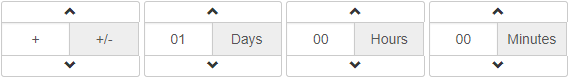

TimingField
=================

A jquery plugin to transform a input field into (+/-) hours/minutes/seconds selector.

Requirements
------------

 * jQuery
 * Twitter Bootstrap
 
Sample
------


Configuration
-------------

This is the current available configuration :

```javascript
$.fn.timingfield.defaults = {
    maxHour: 23,
    minutesInterval: 5,
    width: '100%',
    signText: '+/-',
    daysText: 'D',
    hoursText: 'H',
    minutesText: 'M',
    secondsText: 'S',
    useTimestamp: true,
    signVisible: true,
    daysVisible: true,
    hoursVisible: true,
    minutesVisible: true,
    secondsVisible: true,
    defaultValue: 300
};
```

Usage
-----

```javascript
...
$('.timestamp').timingfield();
...
```
